<!-- Upload this README.md and the assets directory to KartikaySr/KartikaySr. -->

  

  
  
  
  

<strong>Full-stack products. Document intelligence. Data-driven decisions.</strong> 
Computer Science &amp; Engineering (AI &amp; ML) undergraduate at JECRC University · Class of 2027 · Jaipur, India

## 01 / About

I build across **web applications, applied AI and analytical workflows**. I enjoy tracing a problem from the underlying data and business requirements through implementation, evaluation and deployment.

- **Engineering:** built two full-stack products during my Grids Apps internship and led an international distributed development team.
- **Current focus:** simulated energy operations with GridForge AI, retrieval-augmented document intelligence with AetherQ, and transaction-risk modelling.
- **Perspective:** experience in software delivery, data analytics and commercial operations in Nairobi, Kenya.
- **Learning:** B.Tech CSE (AI & ML), **8.72/10 CGPA**; participating in the **McKinsey.org Forward Program**.

## 02 / Selected builds

### [GridForge AI](https://github.com/KartikaySr/GridForge-AI)
**Industrial energy operations · Simulation prototype**

Telemetry ingestion, constrained allocation and an approval-driven dispatch workflow in a desktop/web prototype. Designed to investigate how operational decisions can be validated before a simulated action is issued.

- A saved **9-stage scenario** processed **3,995 synthetic telemetry records**, including outage queueing and reconciliation after reconnection.
- Combines telemetry freshness checks, rolling-mean forecasting, allocation constraints and simulated dispatch acknowledgements.
- **Stack:** React · TypeScript · Tauri · Python · FastAPI · PostgreSQL · SQLite

[Explore the repository →](https://github.com/KartikaySr/GridForge-AI)

### [AetherQ](https://github.com/KartikaySr/AetherQ--RAG-based-Document-Text---to---SQL-analyzer)
**Document intelligence · RAG + Text-to-SQL prototype**

A Next.js/Supabase application for **PDF, DOCX and text ingestion**, pgvector semantic retrieval and source-linked LLM responses.

- Retrieval pipeline uses **1,000-character chunks** with **200-character overlap** to preserve context between chunks.
- Text-to-SQL generates queries against a predefined schema, with optional PostgreSQL execution and tabular results.
- **Stack:** Next.js · TypeScript · Supabase · PostgreSQL · pgvector · Groq

[Live demo ↗](https://aether-q-rag-based-document-text-to.vercel.app/) · [Source code →](https://github.com/KartikaySr/AetherQ--RAG-based-Document-Text---to---SQL-analyzer)

### [Credit Card Fraud Detection](https://github.com/KartikaySr/Credit-Card-Fraud-Detection-System)
**Transaction-risk modelling · ML prototype**

Python feature-engineering and training workflows across **Random Forest, XGBoost, LightGBM and CatBoost**, with interfaces for exploring predictions.

- Saved Random Forest evaluation: **0.88 F1 · 90% precision · 86% recall** on **85,443 test transactions**, including **148 fraud cases**.
- Evaluation is reported for the fraud class from the saved notebook run.
- **Stack:** Python · Pandas · scikit-learn · XGBoost · LightGBM · CatBoost

[Web demo ↗](https://credit-card-fraud-detection-system-beta.vercel.app/) · [Source code →](https://github.com/KartikaySr/Credit-Card-Fraud-Detection-System)

### Analytical notebooks

- **[Logi AI / Call-Centre Simulation](https://github.com/KartikaySr/Call-Centre-Simulation-Logi-AI-V1)** — Python queue simulation comparing **1–5 staffing configurations**, mean and 95th-percentile waiting times, and changing demand assumptions. Built with NumPy, Pandas and Matplotlib.
- **[Statistical A/B Testing Suite](https://github.com/KartikaySr/Statistical-A-B-Testing-Suite)** — synthetic experiment with **17,000 observations** across two arms, conversion comparisons, confidence intervals and a two-proportion z-test. Built with Python, SciPy and Statsmodels.

<strong>More explorations / agent tooling &amp; developer platforms</strong>

- **[MindineersOS](https://github.com/KartikaySr/MindineersOS)** — an agent-platform exploration with a TypeScript monorepo, React dashboard, modular runtime and database integrations. See the repository for implementation details and setup.
- **[CodeAmbers](https://github.com/KartikaySr/CodeAmbers)** — a TypeScript web-platform project organized into frontend and backend workspaces, with dashboard and agent-management interfaces.

## 03 / Toolkit

**Languages**  
Python · SQL · TypeScript · JavaScript

**Frameworks & development**  
React · Next.js · FastAPI · REST APIs · Git/GitHub · Postman

**AI/ML & data**  
Pandas · NumPy · scikit-learn · XGBoost · LLM integration · RAG · Embeddings · Statistical analysis

**Databases & cloud**  
PostgreSQL · SQLite · Supabase · pgvector · Google Cloud Fundamentals

**Foundations**  
Data Structures & Algorithms · OOP · DBMS · Operating Systems · Computer Networks

## 04 / Experience

**Software Engineer Intern · Grids Apps LLC**  
Remote · Jul–Aug 2026

- Built **two full-stack products** while working with and leading an international distributed team, owning deliverables across design, frontend/backend development, API integration, testing, debugging and release preparation.
- Deployed an Android application through **Google Play Console** and a web application to production, managing builds, deployment configuration and release workflows.

*Client/product details are confidential under NDA.*

**Commercial Apprentice · Fracht Kenya Ltd.**  
Nairobi, Kenya · Jul–Aug 2025

- Analyzed commercial opportunities across East African markets and supported business-development research across commercial and operational functions.
- Reviewed logistics data-capture and reporting workflows, identified information gaps and communicated recommendations to senior stakeholders.

**Data Analytics Intern · Samatrix Consulting Pvt. Ltd.**  
Remote · Jun–Jul 2025

- Used Python and Pandas for data preparation, validation and analytical investigation of structured datasets.

## 05 / Leadership & learning

- **Operations Lead, JECRC Incubation Centre** · Oct 2023–Nov 2024 — coordinated entrepreneurship activities and events.
- **Campus Executive, E-Cell IIT Bombay** · Jul–Dec 2024.
- **National Entrepreneurship Challenge 2024 — winning contingent member**, IIT Bombay.
- **Top 4 Team, BitByBit 48-Hour Hackathon** — Cognizance 2025, IIT Roorkee.
- **McKinsey.org Forward Program** — ongoing professional development.

**Selected certifications:** Google Cloud Computing Foundations · Data Analysis Using Python · Deep Learning with Python · Leadership & Team Effectiveness.

## 06 / Connect

Interested in **software engineering, applied AI and technology consulting opportunities**. I like conversations that connect engineering decisions to a useful outcome.

[Portfolio](https://kartikaysrivastava.in/) · [LinkedIn](https://www.linkedin.com/in/kartikaysr/) · [Email](mailto:kartikaymg57@gmail.com) · [All repositories](https://github.com/KartikaySr?tab=repositories)

Understand the problem. Build deliberately. Measure honestly.

